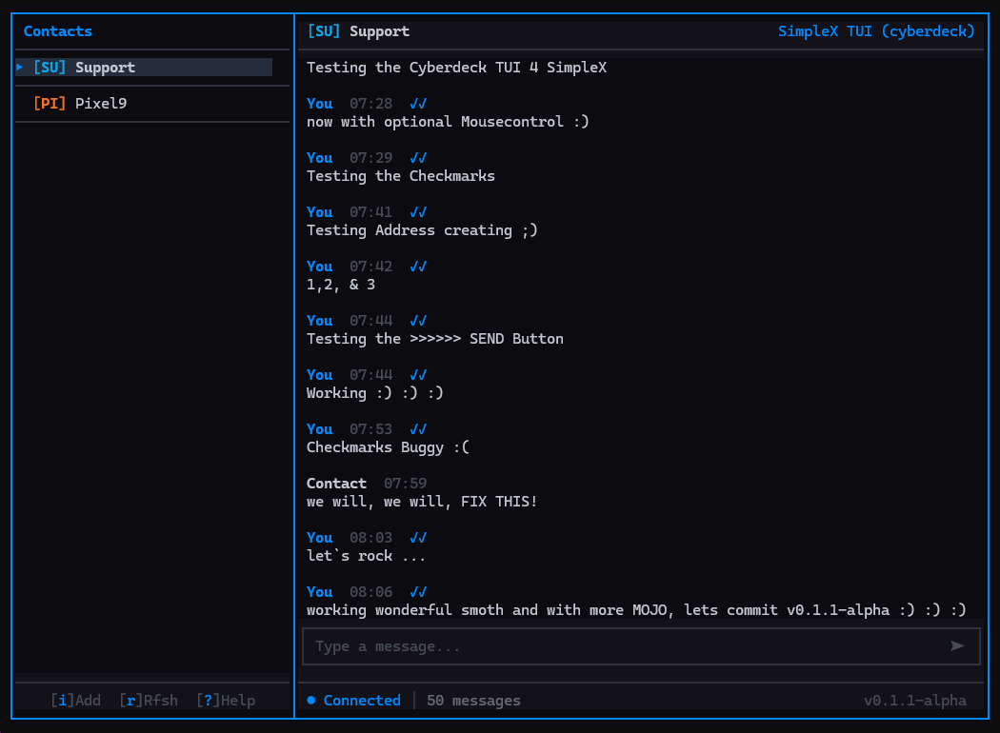

# SimpleX TUI (cyberdeck)

## Terminal-Based Chat Client for SimpleX Messaging Protocol

[](https://www.gnu.org/licenses/agpl-3.0)

[](https://simplex.chat/)
[](#status)
[](#installation)
[](https://github.com/cannatoshi/simplex-tui/commits/main)
[](#contributing)
[](LEGAL.md)

A lightweight, keyboard-driven terminal user interface for SimpleX Chat. Built in Rust with ratatui, designed for cyberdeck enthusiasts, privacy advocates, and anyone who prefers the terminal.

> **Version:** 0.1.1-alpha (06. January 2026)  
> **Status:** Active Development  
> **Tested on:** Debian 12, Ubuntu 24.04, Raspberry Pi OS (64-bit)  
> **Companion to:** [SimpleX Private Infrastructure Tutorial](https://github.com/cannatoshi/simplex-smp-xftp-via-tor-on-rpi5-hardened)

### Main Chat Interface


*Real-time messaging with colored avatars, message status indicators (✓/✓✓), and animated status bar*

---

> ⚠️ **ALPHA SOFTWARE**
>
> This project is in active development. Core features work, but expect rough edges.
> Not recommended for production use without thorough testing.
> 
> ✅ **What works:** Real-time messaging, contact management, address creation/sharing, message status tracking, keyboard navigation, mouse support  
> 🚧 **In progress:** File transfers, group chats, settings UI, Tor integration

---

## 🔒 What's New in v0.1.1-alpha

This release brings a complete UI/UX overhaul with professional polish:

### UI/UX Improvements
- **Fullscreen Modals** - Help, Add Contact, and Panic screens now use full terminal
- **Box-Bordered Buttons** - Professional button styling with clean separators
- **Mouse Click Support** - All buttons and action bar clickable
- **Animated Status Bar** - Rotating messages with typewriter effect
- **Colored Avatars** - Unique colors per contact based on name hash
- **Unread Badges** - Orange `(N)` counter for unread messages

### Address Management (Complete)
- **Create New Address** - Proper delete→create workflow
- **Auto-Refresh** - Modal updates automatically after address creation
- **Share Address** - Display and copy invite links
- **Connect via Link** - Add contacts using SimpleX invite links

### Message System
- **Real-Time Delivery** - WebSocket-based instant messaging
- **Status Tracking** - ○ (pending) → ✓ (sent) → ✓✓ (delivered)
- **Correct Routing** - Messages appear in the right chat
- **Blinking Cursor** - Visual feedback in input field

### Upgrade from v0.1.0
```bash
cd ~/simplex-tui
git pull
cargo build --release
```

---

## ✨ Features

### ✅ Implemented (v0.1.1-alpha)

| Feature | Description |
|---------|-------------|
| **Real-Time Messaging** | WebSocket connection to SimpleX CLI backend |
| **Contact List** | Navigable list with selection markers and avatars |
| **Message History** | Per-contact message storage with timestamps |
| **Delivery Status** | ○ pending → ✓ sent → ✓✓ delivered |
| **Unread Counters** | Badge showing unread messages per contact |
| **Address Management** | Create, refresh, share invite links |
| **Connect to Contacts** | Add contacts via SimpleX invite links |
| **Keyboard Navigation** | Full keyboard control (vim-style optional) |
| **Mouse Support** | Click on contacts, buttons, action bar |
| **Dark Theme** | Cyan/blue color scheme optimized for terminals |
| **Animated Status** | Rotating status messages with typewriter effect |
| **Help System** | Built-in keyboard shortcut reference |
| **Panic Mode** | Quick screen clear for privacy |

### 🚧 In Progress

| Feature | Status | Target |
|---------|--------|--------|
| **File Transfers** | Planned | v0.2.0 |
| **Group Chats** | Planned | v0.2.0 |
| **Settings UI** | Planned | v0.2.0 |
| **Tor Integration** | Planned | v0.3.0 |
| **Notifications** | Planned | v0.3.0 |

### 📋 Planned

| Feature | Description |
|---------|-------------|
| **Message Search** | Search through chat history |
| **Export/Import** | Backup and restore conversations |
| **Themes** | Customizable color schemes |
| **Plugins** | Extensible architecture |

---

## 📸 Screenshots

### Contact List
*Coming soon*

### Help Modal
*Coming soon*

### Add Contact Modal
*Coming soon*

---

## 🏗️ Architecture

```
┌─────────────────────────────────────────────────────────────────┐
│                     SIMPLEX TUI (Terminal)                      │
│  ┌───────────────────────────────────────────────────────────┐  │
│  │  UI Layer (ratatui)                                       │  │
│  │  ├── Contact List    ├── Chat View    ├── Input Field    │  │
│  │  ├── Status Bar      ├── Modals       └── Action Bar     │  │
│  └───────────────────────────────────────────────────────────┘  │
│                              │                                  │
│                    Event Loop (crossterm)                       │
│                              │                                  │
│  ┌───────────────────────────────────────────────────────────┐  │
│  │  App State                                                │  │
│  │  ├── Contacts         ├── Messages     ├── Current Chat   │  │
│  │  ├── Mode (Normal/Input/Modal)         └── Invite Link   │  │
│  └───────────────────────────────────────────────────────────┘  │
│                              │                                  │
│                    WebSocket (tokio-tungstenite)                │
│                              │                                  │
└──────────────────────────────┼──────────────────────────────────┘
                               │
                               ▼
┌─────────────────────────────────────────────────────────────────┐
│                  SIMPLEX CHAT CLI (Backend)                     │
│  ┌───────────────────────────────────────────────────────────┐  │
│  │  WebSocket API (Port 5225)                                │  │
│  │  ├── /contacts         ├── /ad (address)   ├── /c (connect)│  │
│  │  ├── @contact msg      ├── /sa (show addr) └── Events     │  │
│  └───────────────────────────────────────────────────────────┘  │
│                              │                                  │
│                    SimpleX Protocol                             │
│                              │                                  │
└──────────────────────────────┼──────────────────────────────────┘
                               │
                               ▼
┌─────────────────────────────────────────────────────────────────┐
│                     SMP/XFTP SERVERS                            │
│  (Your own .onion servers or public SimpleX infrastructure)    │
└─────────────────────────────────────────────────────────────────┘
```

---

## 📦 Installation

### Prerequisites

| Requirement | Version | Notes |
|-------------|---------|-------|
| **Rust** | 1.92+ | With cargo |
| **SimpleX CLI** | Latest | Running with WebSocket enabled |
| **Terminal** | Any | 256-color support recommended |

### Build from Source

```bash
# Clone repository
git clone https://github.com/cannatoshi/simplex-tui.git
cd simplex-tui

# Build release binary
cargo build --release

# Binary location
./target/release/simplex-tui
```

### Pre-Built Binaries

*Coming soon in GitHub Releases*

---

## 🚀 Quick Start

### 1. Start SimpleX CLI Backend

```bash
# Start simplex-chat with WebSocket API enabled
simplex-chat -p 5225
```

### 2. Run SimpleX TUI

```bash
# From the project directory
./target/release/simplex-tui

# Or if installed globally
simplex-tui
```

### 3. Basic Usage

| Key | Action |
|-----|--------|
| `↑/↓` or `j/k` | Navigate contacts |
| `Enter` | Open chat / Send message |
| `i` | Add contact (show address) |
| `Esc` | Close modal / Cancel |
| `q` | Quit application |
| `?` | Show help |
| `p` | Panic mode (clear screen) |

---

## ⌨️ Keyboard Shortcuts

### Navigation

| Key | Action |
|-----|--------|
| `↑` / `k` | Move up in contact list |
| `↓` / `j` | Move down in contact list |
| `Enter` | Select contact / Send message |
| `Tab` | Switch focus (contacts ↔ input) |

### Actions

| Key | Action |
|-----|--------|
| `i` | Add contact (show invite address) |
| `r` | Refresh contacts |
| `?` | Toggle help modal |
| `p` | Panic mode (emergency clear) |
| `q` | Quit application |
| `Esc` | Close modal / Cancel input |

### In Add Contact Modal

| Key | Action |
|-----|--------|
| `g` | Refresh address |
| `c` | Create new address |
| `Enter` | Connect using pasted link |
| `Esc` | Close modal |

### Mouse Support

- **Click contact** → Select and open chat
- **Click buttons** → Activate (Refresh, Create, Close)
- **Click action bar** → [i]Add, [r]Rfsh, [?]Help

---

## 🔧 Configuration

### Environment Variables

```bash
# WebSocket connection (default: ws://localhost:5225)
SIMPLEX_WS_URL=ws://localhost:5225

# Enable debug logging
RUST_LOG=debug
```

### SimpleX CLI Setup

The TUI requires SimpleX CLI running with WebSocket API:

```bash
# Basic setup
simplex-chat -p 5225

# With custom database
simplex-chat -p 5225 -d ~/.simplex/myprofile

# With Tor (for .onion servers)
simplex-chat -p 5225 --socks-proxy=localhost:9050
```

---

## 📁 Project Structure

```
simplex-tui/
├── src/
│   ├── main.rs           # Entry point, event loop
│   ├── app.rs            # Application state
│   ├── types.rs          # Data structures
│   ├── colors.rs         # Color scheme and avatar colors
│   ├── handlers.rs       # Keyboard and mouse event handlers
│   ├── websocket.rs      # WebSocket connection to SimpleX CLI
│   └── ui/
│       ├── mod.rs        # UI module exports
│       ├── layout.rs     # Main layout structure
│       ├── contacts.rs   # Contact list rendering
│       ├── chat.rs       # Chat view rendering
│       ├── input.rs      # Input field rendering
│       ├── status.rs     # Animated status bar
│       └── modals.rs     # Help, Add Contact, Panic modals
├── Cargo.toml            # Rust dependencies
├── README.md             # This file
├── LICENSE               # AGPL-3.0
├── CHANGELOG.md          # Version history
└── screenshots/          # UI screenshots
```

---

## 🛠️ Tech Stack

| Component | Technology |
|-----------|------------|
| **Language** | Rust 1.92+ |
| **TUI Framework** | ratatui 0.29 |
| **Terminal Backend** | crossterm |
| **Async Runtime** | tokio |
| **WebSocket** | tokio-tungstenite |
| **JSON Parsing** | serde_json |
| **Backend** | SimpleX Chat CLI |

---

## 🗺️ Roadmap

### v0.2.0 - Enhanced Communication
- [ ] File transfer support (XFTP)
- [ ] Group chat support
- [ ] Message reactions
- [ ] Reply to messages

### v0.3.0 - Privacy & Security
- [ ] Built-in Tor support
- [ ] Message encryption indicators
- [ ] Contact verification
- [ ] Screen lock

### v0.4.0 - Polish & Customization
- [ ] Custom themes
- [ ] Configurable keybindings
- [ ] Message search
- [ ] Export/import

### v1.0.0 - Production Ready
- [ ] Stable API
- [ ] Full test coverage
- [ ] Documentation
- [ ] Package managers (apt, brew, cargo)

---

## 🐛 Troubleshooting

### WebSocket Connection Failed

```bash
# Check if SimpleX CLI is running
ps aux | grep simplex-chat

# Start SimpleX CLI with WebSocket
simplex-chat -p 5225

# Check port is listening
ss -tlnp | grep 5225
```

### No Contacts Showing

```bash
# Verify SimpleX CLI has contacts
# In SimpleX CLI directly:
/contacts

# Check WebSocket response
websocat ws://localhost:5225
```

### Messages Not Sending

```bash
# Check terminal size (minimum 80x24 recommended)
echo "Columns: $COLUMNS, Lines: $LINES"

# Enable debug logging
RUST_LOG=debug ./target/release/simplex-tui
```

### Build Errors

```bash
# Update Rust
rustup update

# Clean and rebuild
cargo clean
cargo build --release
```

---

## 🤝 Contributing

Contributions are welcome! Please:

1. Fork the repository
2. Create a feature branch (`git checkout -b feat/amazing-feature`)
3. Commit your changes (`git commit -s -m 'feat: Add amazing feature'`)
4. Push to the branch (`git push origin feat/amazing-feature`)
5. Open a Pull Request

See [CONTRIBUTING.md](CONTRIBUTING.md) for detailed guidelines.

### Priority Areas

| Area | Difficulty | Impact |
|------|------------|--------|
| File Transfer UI | Medium | High |
| Group Chat Support | Hard | High |
| Theme System | Easy | Medium |
| Vim Keybindings | Easy | Medium |
| Documentation | Easy | High |

---

## 📚 Related Projects

- **[SimpleX Chat](https://github.com/simplex-chat/simplex-chat)** - The SimpleX Chat application
- **[SimpleX Private Infrastructure](https://github.com/cannatoshi/simplex-smp-xftp-via-tor-on-rpi5-hardened)** - Deploy SimpleX servers on Raspberry Pi
- **[SimpleX SMP Monitor](https://github.com/cannatoshi/simplex-smp-monitor)** - Web-based monitoring for SimpleX infrastructure

---

## ⚖️ License

This project is licensed under the **GNU Affero General Public License v3.0** (AGPL-3.0).

See [LICENSE](LICENSE) for the full license text.

---

## ⚠️ Disclaimer

This software is provided "AS IS" without warranty of any kind. The authors are not responsible for any damages or issues arising from its use.

> **Note:** This project is **not affiliated with or endorsed by SimpleX Chat Ltd**.  
> "SimpleX" is a trademark of SimpleX Chat Ltd. See [TRADEMARK.md](TRADEMARK.md) for details.

For complete legal information, see:
- [LEGAL.md](LEGAL.md) - Legal documentation overview
- [TRADEMARK.md](TRADEMARK.md) - Trademark information
- [DISCLAIMER.md](DISCLAIMER.md) - Full liability disclaimer

---

## 📝 Changelog

See [CHANGELOG.md](CHANGELOG.md) for detailed version history.

### Recent Changes

**v0.1.1-alpha (2026-01-06)**
- Complete UI/UX redesign
- Address management system
- Message routing fix
- Unread counters
- Mouse support
- Animated status bar

**v0.1.0-alpha (2026-01-05)**
- Initial release
- Basic messaging
- Contact list
- WebSocket integration

---

## 📬 Contact

- **GitHub:** [@cannatoshi](https://github.com/cannatoshi)
- **Issues:** [GitHub Issues](https://github.com/cannatoshi/simplex-tui/issues)

---

<p align="center">
  <sub><strong>Disclaimer:</strong> This project is not affiliated with, endorsed by, or officially connected with SimpleX Chat Ltd.</sub><br>
  <sub>"SimpleX" is a trademark of SimpleX Chat Ltd. See <a href="TRADEMARK.md">TRADEMARK.md</a> for details.</sub><br>
  <sub>Built with 💙 for the SimpleX ecosystem and cyberdeck enthusiasts.</sub>
</p>

<p align="center">
  <sub>i(N) cod(E) w(E) trus(T)</sub>
</p>
